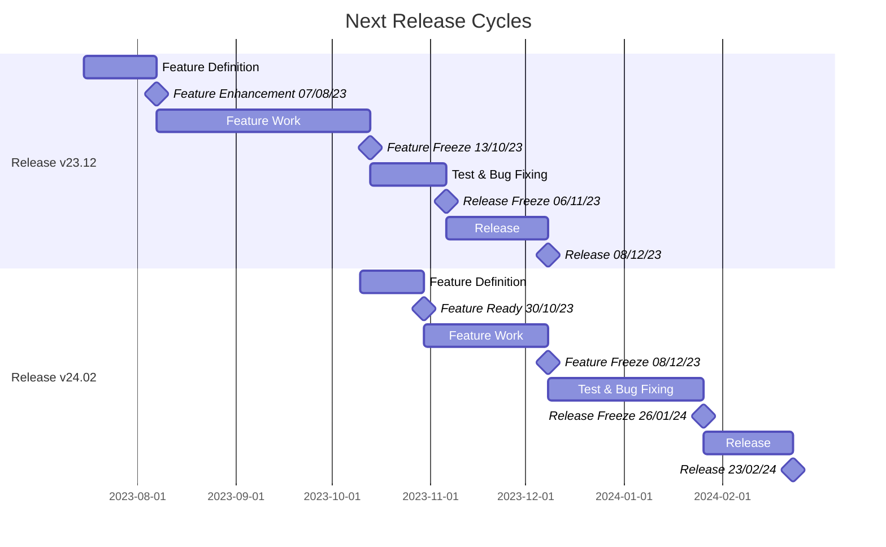

# Release Information

## Introduction

[Catena-X Standards](https://catena-x.net/de/standard-library) are the foundation for certifying any software component operating in the Catena-X data space. Those standards are the binding reference to obtain a valid certificate.

To make adopting the latest Catena-X standards easier, reference implementations are provided through the Elipse Tractus-X Project. Releases of these reference implementations happen four times a year using a [calendar versioning](https://calver.org/) scheme, and include the operating system consisting of core services, enablement services, and KITs.

Please check the [Change Log](/CHANGELOG) for content, known knowns, and backward compatibility since the calendar versioning scheme readily shows the year and month of release.

## Release Cycle

### Feature Definition (2 Weeks)

- Feature discussions per product team (ongoing through the year)
- Selection of features targeting for a given release
- Feature readiness latest by alignment and planing meetings

**Milestone:** Enhancements Freeze (in week 2)

### Feature Work (ca. 10 weeks)

- Feature development and reviews (in sprints / iterations)
- Unit and integration tests

**Milestone:** Feature / Code Freeze (in week 12)

### Test & Bug Fixing (ca. 4 Weeks)

- System and (E2E) acceptance tests
- Bug fixing and testing (iterative)

Release Freeze (in week 16 )

### Release

- Enhancement pass all relevant release gates
- Release communication (e.g. update of change log / release notes)

Release (in week 20)

## The next two Release Cycles in detail

